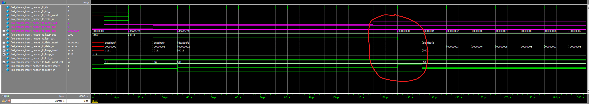
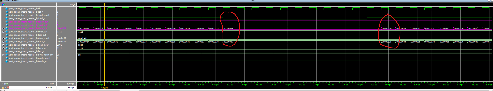
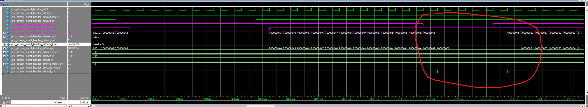
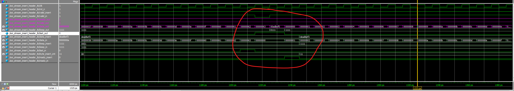
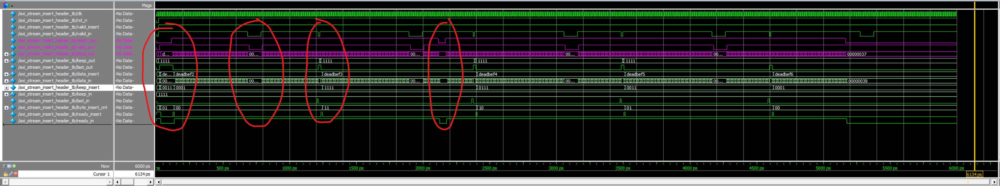

# Inserting headers to AXI stream

This project implements a module that inserts a header into a data packet being transmitted from a master to a slave. Data transmission and signal types adhere to the AXI Stream protocol. This module could be useful for network communications, where data packets are streamed from one device to another. For each packet, a header must be inserted before the actual data, containing essential information such as the IP address, packet length, etc.

## RTL Design

Due to area constraints, the entire design was engineered without using FIFOs or state machines. The top-level module, located in `axi_stream_header_insert.v`, has two sets of input ports and one set of output ports. One set of inputs is connected to a potential AXI Stream master device, feeding data in packets (bursts). The other set of inputs is connected to another master device providing a header for each data packet. The outputs are connected to a slave device.

Between the slave and the two masters, all signals, both the actual data and the handshake signals, travel in two pipelines, each with a pipeline register. To handle backpressure from the slave and eliminate bubbles efficiently, skid buffers, implemented in `skid_buffer.sv`, equip both registers in the pipelines. Although designed with a single pipeline stage for simplicity, adding more stages could be achieved with minimal effort. Arbitrations allow two masters to communicate with one slave.

Upon resetting, the `axi_stream_header_insert` module waits for a header from the header master. Once received, and a handshake observed, it discards the null bytes in the header by setting them to 0 and sends it to the slave. Then, the module transmits an entire packet of data from the stream master to the slave, preceded by the inserted header. At the end of the packet, signaled by the `last` signal, the module processes another header, masks its null bytes, and transmits another data packet. This process then repeats.

## Simulation

The RTL design has been successfully synthesized (`axi_stream_insert_header.vo`). A post-synthesis simulation was implemented. In the testbench (`axi_stream_insert_header_tb.sv`), the Device Under Test (DUT) is instantiated, along with an RTL header master implemented in `axi_header_master.sv`. The stream master and slave, embedded in the testbench, have behavior controllable by random numbers.

Figure 1 shows the simulation waveform at the test's start. After resetting, `valid_out` to the slave goes high, indicating the presence of valid data in the skid buffer on the header side. The slave idles for some cycles, as shown by the deasserted `ready_out` signal. During the clock cycle highlighted in red, the slave asserts `ready_out`, initiating the data stream. The first cycle when `ready_out` goes high, a data transfer occurs with the data `‘hdeadbeef`, generated by the header master, with no null bytes as `keep_out` is `’b1111` in that cycle. After inserting the header, the module allows data packets from the stream master to begin, with the data starting from 0 and incrementing each cycle. Throughout this process, the handshake remains effective (`ready_out` && `valid_out`), indicating no data loss. Also, note there are no bubbles in either the header or the packet, ensuring a valid and timely data transfer occurs the moment `ready_out` is pulled high.

**Figure 1: Initial simulation waveform showing valid data transmission and the first header insertion.**

Figure 2 illustrates a scenario when the stream master deasserts its `valid_in` signal for a period. No data loss or duplication is observed, as indicated by the red circles. There are no bubbles either.

**Figure 2: Stream master's `valid_in` deassertion with no data loss or duplication.**

Figure 3 depicts a scenario when the slave deasserts its `ready_in` for a period, effectively applying backpressure to the pipeline. Upon reassertion, no data loss or duplication can be observed, as indicated by the red circles. No bubbles are present either.

**Figure 3: Effective backpressure handling by the slave with no data loss or bubbles.**

Figure 4 shows that at the end of a packet, i.e., `data_out` is `’h63`, and `last_out` is high, the module inputs a new header in the next cycle, `’h00adbef0`, which is the previous header incremented by 1, with the most significant byte masked out, because `keep_out` is `’b0111`. Again, there are no bubbles.

**Figure 4: Header insertion at the start of a new packet.**

Figure 5 provides a zoomed-out view of the complete simulation waveform, with areas of interest circled in red.
**Figure 5: Overview of the simulation waveform, highlighting key transmission events.**

