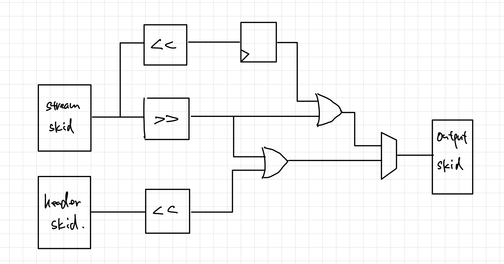
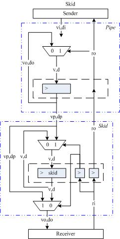
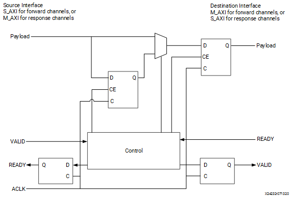
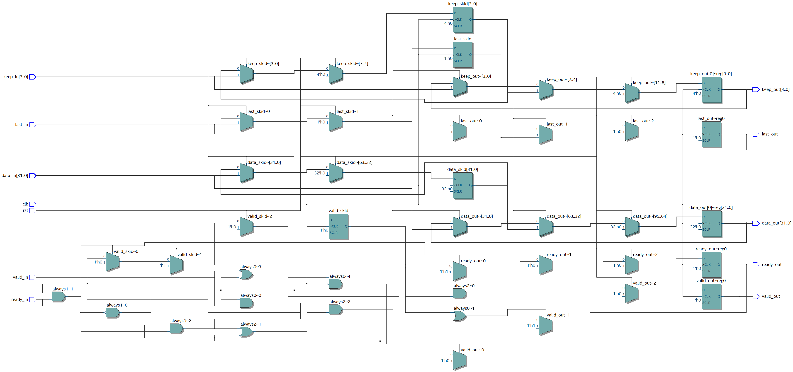
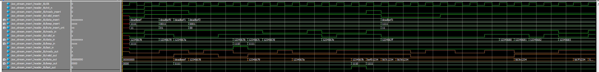
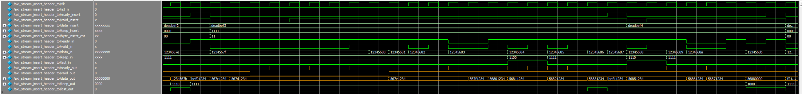
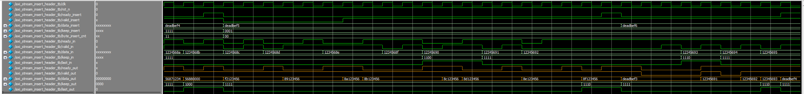
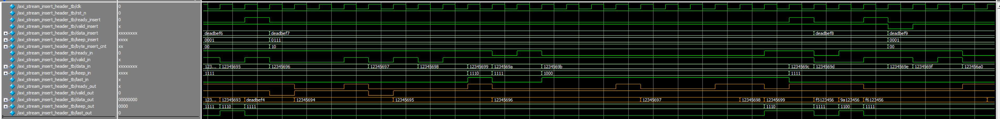
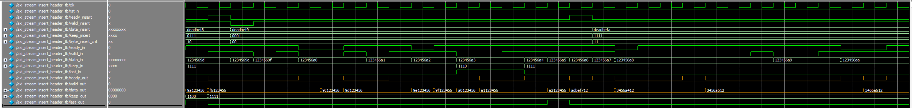

# Inserting headers to AXI stream

This project implements a module that inserts a header into a data packet being transmitted from a master to a slave. Data transmission and signal types adhere to the AXI Stream protocol. This module could be useful for network communications, where data packets are streamed from one device to another. For each packet, a header must be inserted before the actual data, containing essential information such as the IP address, packet length, etc.

## RTL Design

Due to area constraints, the entire design was engineered without using FIFOs or state machines. The top-level module, located in `axi_stream_header_insert.v`, has two sets of input ports and one set of output ports. One set of inputs is connected to a potential AXI Stream master device, feeding data in packets (bursts). The other set of inputs is connected to another master device providing a header for each data packet. The outputs are connected to a slave device.

Between the slave and the two masters, all signals, both the actual data and the handshake signals, travel in two pipelines, each with a pipeline register. To handle backpressure from the slave and eliminate bubbles efficiently, skid buffers, implemented in `skid_buffer.sv`, equip both registers in the pipelines. Although designed with a single pipeline stage for simplicity, adding more stages could be achieved with minimal effort. Arbitrations allow two masters to communicate with one slave.

Upon resetting, the `axi_stream_header_insert` module waits for a header from the header master. Once received, and a handshake observed, it discards the null bytes in the header by setting them to 0 and sends it to the slave. Then, the module transmits an entire packet of data from the stream master to the slave, preceded by the inserted header. At the end of the packet, signaled by the `last` signal, the module processes another header, masks its null bytes, and transmits another data packet. This process then repeats.

### Pipeline register with skid buffer (registered output)
The design concepts of pipeline register and skid buffer are based on [this post](https://www.twblogs.net/a/5bfae448bd9eee7aed32c7d0). However, the design implemented there has outputs (valid and data) coming from a mux, which selects between the pipeline register and the skid buffer. 

Directly registered outputs are desired to prevent issues like glitches and to improve timing, illustrated by the design from Xilinx below, taken from [here](https://docs.xilinx.com/r/en-US/pg373-axi-register-slice/Fully-Registered).

The design implemented in this project is based on this schematic, and the RTL code is based on the design from [Altera Cookbook](https://github.com/thomasrussellmurphy/stx_cookbook/blob/master/storage/ready_skid.v). The synthesized circuit indeed shows directly registered outputs.

## Simulation

The RTL design has been successfully synthesized (`axi_stream_insert_header.vo`). A post-synthesis simulation was implemented and the waveforms are presented below.

